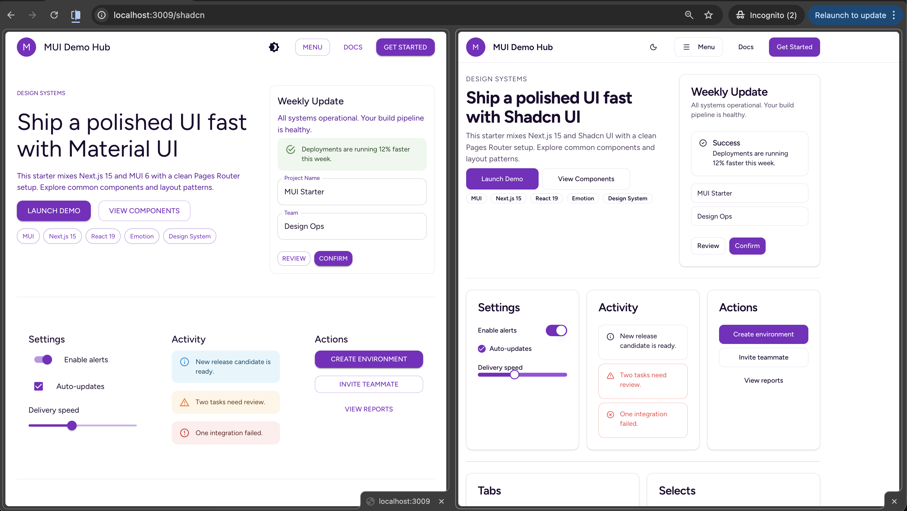

# Next.js + MUI + Shadcn UI Starter

A Next.js starter combining Material UI and Shadcn UI components with Pages Router. Features dark mode, theme switching, and comprehensive component demos.

**Versions:** Next.js 15.1.11, React 19.0.1, MUI 6.4.12, Tailwind CSS 4.1.18

Run `npm run dev` to start the development server on port 3009.

